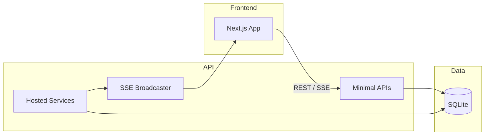

# Architecture

## High-level overview

The Incident Intelligence Platform is a full-stack observability and incident-intelligence system with a .NET 9 Web API backend, SQLite persistence, and a Next.js frontend.

## Components

- **API** (`src/IncidentBrain.API`): ASP.NET Core Minimal APIs, health and stats, incidents CRUD, simulation control (dev only in production), SSE endpoint for real-time incident stream. Middleware: correlation ID, exception handling, rate limiting, CORS.
- **Hosted services**: `LogProcessorHostedService` consumes the log stream, runs TF-IDF clustering and spike detection, creates incidents and enriches them with AI; `RetentionEnforcementHostedService` runs auto-resolution and retention caps.
- **Core** (`src/IncidentBrain.Core`): Domain (Incident, LogEntry, etc.), interfaces (`IIncidentStore`, `ILogStreamSimulator`, `IAIService`). No external dependencies.
- **Infrastructure** (`src/IncidentBrain.Infrastructure`): SQLite store, TF-IDF clustering, spike detection, Mock and Ollama AI implementations.
- **Frontend** (`web/incidentbrain-web`): Next.js App Router, dashboard (incidents, charts, filters), settings (dev only when not read-only), SSE hook for live updates.

## Data flow

1. Log stream: Simulated (or future real) logs are produced by `SimulatedStreamSource`. In production, the stream starts when the first SSE client connects and stops when the last disconnects.
2. Logs are buffered and written to SQLite via `IIncidentStore.AddLogsAsync`.
3. Periodically, recent logs are clustered (TF-IDF + cosine similarity) and spikes detected; new incidents are created and enriched with AI summaries/steps, then saved and broadcast over SSE.
4. Retention and auto-resolution run in the background; caps on active/total incidents and log count are enforced at the persistence layer.

See [LOG_STREAMING_LIFECYCLE.md](LOG_STREAMING_LIFECYCLE.md), [CLUSTERING_ENGINE.md](CLUSTERING_ENGINE.md), [SQLITE_RETENTION.md](SQLITE_RETENTION.md), and [INCIDENT_LIFECYCLE.md](INCIDENT_LIFECYCLE.md) for details.
