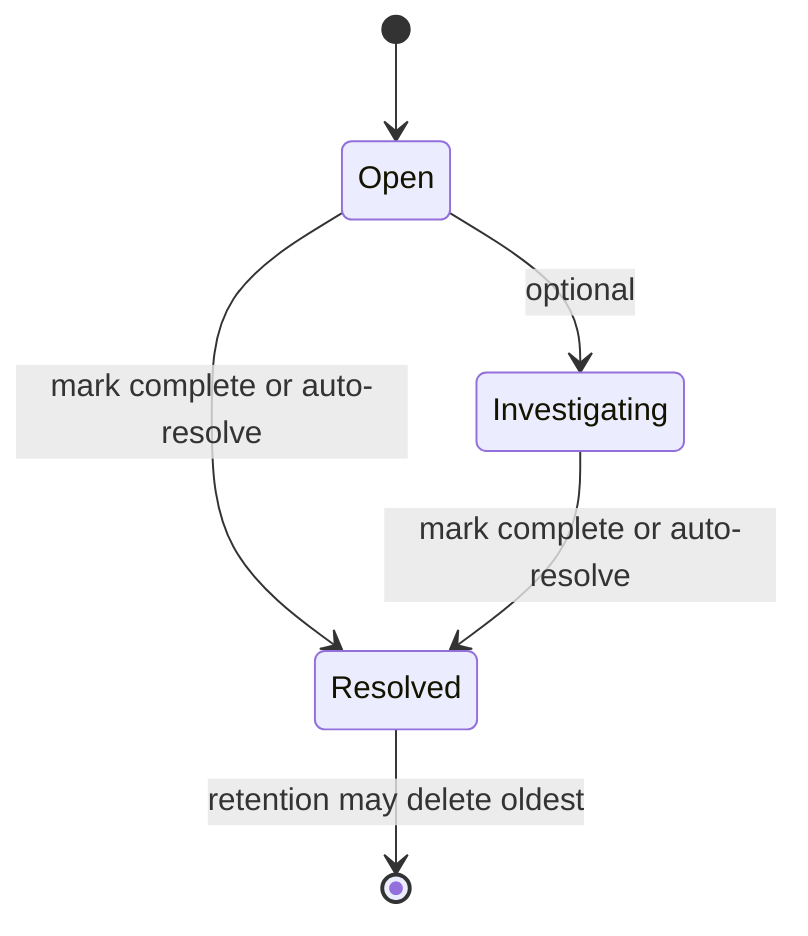

# Incident lifecycle

## States

- **Open**: Newly created.
- **Investigating**: Optional intermediate state (e.g. when a user marks as in progress).
- **Resolved**: Closed; `EndTime` set. Can be reached by manual “Mark complete” or by **auto-resolution**.

## Auto-resolution

- If an incident is not Resolved and has had **no activity** for a configurable period (`Retention:AutoResolveIdleMinutes`), a background job sets its status to **Resolved** and sets `EndTime = UtcNow`.
- “Activity” is represented by `UpdatedAt` (e.g. updated when the incident is linked to new cluster data or when the user changes status).

## Bounded growth

- **Active cap**: At most `MaxActiveIncidents` open/investigating incidents. When at cap, oldest resolved are purged before creating a new one.
- **Total cap**: At most `MaxTotalIncidents` incidents in the store. When over cap, oldest resolved are deleted. Active incidents are never auto-deleted.

## Manual actions (development only)

- In non–read-only mode, users can mark an incident as Resolved (“Mark complete”) or reopen it (“Reopen”). In production (read-only), these controls are hidden and the corresponding API endpoints are disabled.
